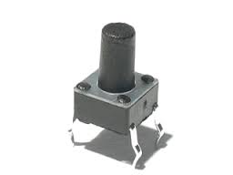

El proyecto consiste en modificar un coche teledirigido para que funcione de manera autónoma y esquive obstáculos.

Para ello, aparte del coche, vamos a utilizar Arduino UNO, un emisor/receptor de ultrasonidos (HC SR04) y un pulsador con rebote.

- [EL COCHE](#el-coche)
- [EL CEREBRO](#el-cerebro)
- [LOS OJOS](#los-ojos)
- [EL TACTO](#el-tacto)
- [LA MENTE](#la-mente)

------

## EL COCHE

Básicamente, cualquier circuito de vehículo RC consta de tres partes:

1. Receptor. Escucha la señal de radio y la transforma para ser procesada.

2. Controlador. Microchip que, en función del circuito receptor, ordena el movimiento de los motores.

3. Puente en H. Necesario para gobernar los motores, en función de la señal del controlador.

Para que Arduino gobierne el coche, tendremos que anular el receptor y sustituir el controlador por nuestra placa.

Para lo primero, no tenemos más que cortar la antena, o aislarla de cualquier otra manera.

Para lo segundo, tendremos que identificar dónde están las entradas del puente en H.

En nuestro caso, el chip que controla los motores es el RX-2 20926028.

Si no conseguimos la hoja de datos del microcontrolador, una forma sencilla de averiguar qué patilla controla cada movimiento es ir tocando con un cable a 5V cada patilla del chip. Así veremos qué movimientos hace el coche y podremos identificarlo.

En nuestro ejemplo, la correspondencia sería así.

Tensiones aproximadas medidas en las pletinas de las pilas del coche.

## EL CEREBRO

Digamos que hay tres maneras de alimentar a Arduino UNO.

1.Una es a través del USB, sin más, conectado al ordenador por ejemplo.

2.Otra es mediante el conector Jack.

3.La última utilizando los pines Vin y GND.

**1.** El  **USB****  **lo utilizaremos para cargar el código en el microcontrolador. El cable

​          para programar es un USB A/B, como el de las impresoras.

Pero ... ¿cómo lo alimentamos cuando lo desconectemos de nuestro ordenador?

**2.** La manera más sencilla es a través del  **Jack** de Arduino.

**3.** O a través de los pines  **Vin y GND** , tensiones entre 7 y 12V.

De manera que utilizaremos la salida a 9V del coche para alimentar Arduino a través del PIN Vin.

## LOS OJOS

HC SR04

VCC --> 5V.

Trig --> Emite ultrasonido.

Echo --> Recibe ultrasonido.

GND --> Tierra.

## EL TACTO

Un pulsador con rebote permitirá al coche modificar su trayectoria si choca contra cualquier objeto macizo. Recordemos que los ultrasonidos no rebotan contra todos los materiales.

## LA MENTE

Correspondencia con pines de Arduino.

| **PIN** | FUNCIÓN |
| --- | --- |
| 3 | TRIG |
| 2 | ECHO |
| 13 | DERECHA |
| 10 | IZQUIERDA |
| 12 | ADELANTE |
| 11 | ATRÁS |
| 7 | CHOQUE |

[Código fuente](src/arducar.ino)

ESQUEMA ELÉCTRICO

Desarrollado por

Claudio Becerra cbecmor@gmail.com

Javier Hernández jaf\_lan@hotmail.com

Sergio Polo sergiopolog@gmail.com

Javier Sopeña javier.sopena.arias@gmail.com